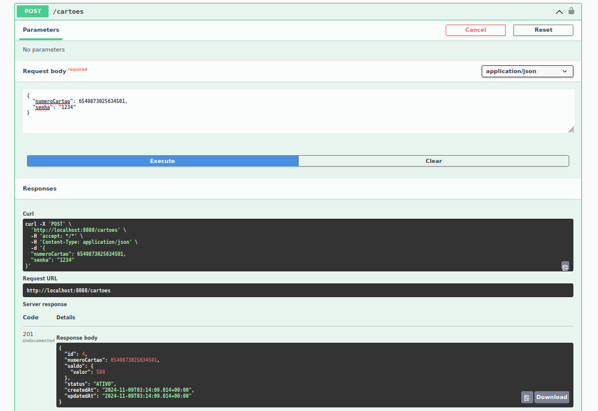

# Prova VR

Avaliação técnica de uma API de Mini Autorizador, desenvolvido em Java com Spring-Boot.

## Características

- CRUD
- API RESTful
- Validation
- Enum
- Exception
- MockMVC

## Requisitos

- Java JDK 17
- Apache Maven >= 3.8.6
- MySql 8
- Docker (Opcional)

## Tecnologias

- Java
- JPA
- Maven
- Spring
- Lombok
- Swagger
- H2
- JUnit
- SonarQube
- Docker

## Instalação

```
$ git clone https://github.com/danilomeneghel/prova-vr.git

$ cd prova-vr
```

## Maven

Para rodar o projeto com Maven, é necessário ter a versão 3.8.6 instalada.<br>
Além disso, é preciso ter o Java 17 e o MySql 8 instalado.<br>

Tendo tudo instalado e rodando localmente, basta executar o seguinte comando:

```
$ cd miniautorizador
$ mvn clean install -U
$ mvn spring-boot:run -Dspring-boot.run.profiles=dev
```

Caso não tenha o Maven instalado ou tenha outra versão, pode usar o comando ./mvnw (no Linux) ou mvnw.cmd (no Windows).

## Docker (Opcional)

Para rodar o projeto via Docker-Compose, basta executar o comando:

```
$ cd docker
$ docker-compose up
```

Aguarde baixar as dependências e carregar todo o projeto, esse processo é demorado. <br>
Caso conclua e não rode pela primeira vez, tente novamente executando o mesmo comando. <br>

Para encerrar tudo digite:

```
$ docker-compose down
```

Aguarde carregar todo o serviço web. <br>
Após concluído, digite um dos endereços abaixo em seu navegador. <br>

Listar cartões cadastrados: <br>
http://localhost:8080/cartoes

Listar transações cadastradas: <br>
http://localhost:8080/transacoes

## Swagger 

Documentação da API RESTful: <br>

http://localhost:8080/swagger-ui.html

Login:
  - Usuário: username
  - Senha: password

## SonarQube

Para verificar a cobertura de testes, primeiro acesse o seguinte endereço: <br>
http://localhost:9000

Depois efetue o login preenchendo "admin" no usuário e senha (login padrão). <br>
Ao se logar crie um novo projeto e gere o token.

Feito isso, entre no container criado da api:

```
$ docker exec -it api bash
```

Execute o seguinte comando do sonar:

```
$ mvn clean verify sonar:sonar -Dsonar.projectKey=NOME_PROJETO_GERADO -Dsonar.host.url=http://sonarqube:9000 -Dsonar.login=TOKEN_GERADO
```

Após executado, acesse o seguinte endereço: <br>

http://localhost:9000/dashboard?id=prova-vr

## Testes

Para realizar os testes, execute o seguinte comando no terminal:

```
$ cd miniautorizador
$ mvn test
```

## Screenshots

Swagger-UI <br>
 <br><br>

Modelagem ER <br>
 <br><br>

## Licença

Projeto licenciado sob <a href="LICENSE">The MIT License (MIT)</a>.<br><br>


Desenvolvido por<br>
Danilo Meneghel<br>
danilo.meneghel@gmail.com<br>
http://danilomeneghel.github.io/<br>
